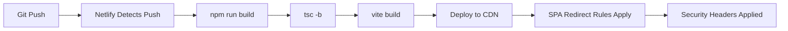
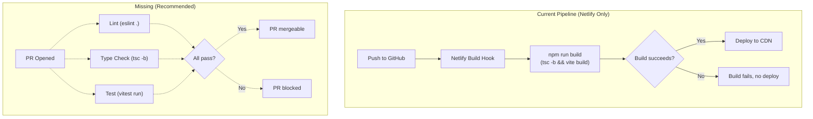

# DevOps & Infrastructure Audit Report

**Run**: 01 | **Date**: 2026-03-18 | **Branch**: `nightytidy/run-2026-03-18-1312`
**App**: Nimbus Weather — pure client-side SPA (React 19 + TypeScript 5.9 + Three.js)
**Deploy**: Netlify static CDN | **Backend**: None | **Database**: None

---

## 1. Executive Summary

### Overall Health: **Good** (for a client-side SPA)

Nimbus Weather is a pure client-side application with minimal infrastructure complexity. There is no backend, no database, no secrets, and no multi-environment deployment pipeline. This dramatically reduces the DevOps attack surface but also means several audit phases (migrations, secret management, multi-env config) are not applicable.

### Top 5 Findings

1. **No CI/CD pipeline exists** — No GitHub Actions, GitLab CI, or any automated pipeline. Builds rely entirely on Netlify's built-in build system with no pre-merge checks (lint, test, type-check).
2. **No `.env.example` or configuration documentation** — Despite hardcoded API endpoints and constants, there's no central configuration reference for contributors.
3. **Logging is minimal but appropriate** — Only 2 `console.error` calls in error boundaries. No sensitive data logged. No logging library needed at this scale.
4. **No database migrations** — Pure client-side, localStorage-only persistence. Not applicable.
5. **Security headers are well-configured** — CSP, X-Frame-Options, CORS restrictions, and asset caching are all properly set in `netlify.toml`.

### Quick Wins Implemented

- Created `docs/CONFIGURATION.md` documenting the full configuration surface area
- No code changes warranted — the codebase is clean and well-structured for its architecture

---

## 2. CI/CD Pipeline

### Current State

**No CI/CD pipeline exists.** The project has:
- No `.github/workflows/` directory
- No `.gitlab-ci.yml`
- No `Jenkinsfile`
- No `.circleci/config.yml`

The entire build/deploy process is handled by **Netlify**:



### What Netlify Provides

| Capability | Status | Notes |
|-----------|--------|-------|
| Build on push | Yes | Triggers `npm run build` (tsc + vite) |
| Deploy previews | Yes (Netlify default) | PR previews auto-generated |
| SPA routing | Yes | `/* → /index.html` redirect |
| Security headers | Yes | CSP, X-Frame-Options, X-Content-Type-Options |
| Asset caching | Yes | `/assets/*` immutable, 1-year max-age |
| HTTPS | Yes | Netlify default |
| Rollback | Yes | Netlify dashboard, one-click |

### What Netlify Does NOT Provide

| Missing Capability | Impact | Risk |
|-------------------|--------|------|
| Pre-merge lint/test/type-check | Broken code can be merged | Medium |
| Test results on PR | No quality gate before merge | Medium |
| Build caching (node_modules) | Slower builds (~reinstall every time) | Low |
| Bundle size tracking | No regression alerts | Low |
| Lighthouse CI | Performance regressions undetected | Low |

### Pipeline Diagram



### Optimizations Implemented

None — there is no pipeline to optimize. The Netlify build configuration is already minimal and efficient.

### Larger Recommendations

| Recommendation | Estimated Savings | Effort |
|---------------|-------------------|--------|
| Add GitHub Actions CI (lint + test + type-check on PRs) | Prevents broken merges | 30 min |
| Add Netlify build plugin for node_modules caching | ~30-60s per build | 10 min |
| Add bundle size check in CI | Catches size regressions | 20 min |

---

## 3. Environment Configuration

### Variable Inventory

This is a **zero-config** client-side application. There are no environment variables, no `.env` files, and no `import.meta.env` or `process.env` references in the codebase.

| Configuration | Location | Value | Configurable? | Notes |
|--------------|----------|-------|--------------|-------|
| Geocoding API URL | `src/lib/api.ts:3` | `https://geocoding-api.open-meteo.com/v1/search` | No (hardcoded) | Open-Meteo, no API key |
| Forecast API URL | `src/lib/api.ts:4` | `https://api.open-meteo.com/v1/forecast` | No (hardcoded) | Open-Meteo, no API key |
| Geocoding result limit | `src/lib/api.ts:5` | `8` | No (hardcoded) | Max search results |
| Forecast days | `src/lib/api.ts:6` | `6` | No (hardcoded) | Today + 5 |
| Min search query length | `src/lib/api.ts:7` | `2` | No (hardcoded) | Characters |
| Max search query length | `src/lib/api.ts:8` | `200` | No (hardcoded) | Characters |
| Geocoding cache TTL | `src/lib/api.ts:9` | `5 min` | No (hardcoded) | In-memory |
| Geocoding cache max entries | `src/lib/api.ts:10` | `50` | No (hardcoded) | FIFO eviction |
| Forecast cache TTL | `src/lib/api.ts:11` | `5 min` | No (hardcoded) | In-memory |
| Forecast cache max entries | `src/lib/api.ts:12` | `10` | No (hardcoded) | FIFO eviction |
| Fetch timeout | `src/lib/api.ts:13` | `10s` | No (hardcoded) | AbortSignal.timeout |
| Geolocation timeout | `src/lib/geolocation.ts:1` | `8s` | No (hardcoded) | Browser API |
| Geolocation max age | `src/lib/geolocation.ts:39` | `5 min` | No (hardcoded) | Browser cache |
| localStorage key | `src/lib/storage.ts:3` | `nimbus-preferences` | No (hardcoded) | Single key |
| Max recent cities | `src/lib/storage.ts:4` | `5` | No (hardcoded) | FIFO |
| Debounce delay | `src/hooks/useDebounce.ts` | `300ms` | No (hardcoded) | Search input |
| DPR cap | `src/scenes/WeatherScene.tsx` | `2` | No (hardcoded) | WebGL performance |

### Issues Found

| Issue | Severity | Status |
|-------|----------|--------|
| No `.env.example` documenting configurable values | Low | Addressed in `docs/CONFIGURATION.md` |
| All API config hardcoded as constants | Info | Appropriate for this app — no multi-env needs |
| No contributor onboarding doc for config | Low | Addressed in `docs/CONFIGURATION.md` |

### Issues NOT Applicable

| Category | Why N/A |
|----------|---------|
| Secret management | No secrets — Open-Meteo is free, keyless |
| Dev/prod divergence | Single environment (Netlify CDN) |
| Dangerous defaults | No debug mode, no mock providers |
| Missing production config | No error reporting service (acceptable at this scale) |
| Secret rotation readiness | No secrets to rotate |
| Startup validation | Client-side app — no startup phase with env var loading |

### Kill Switch & Operational Toggle Inventory

| Toggle | Controls | Change Mechanism | Latency | Documented? |
|--------|----------|-----------------|---------|-------------|
| Dark mode toggle | Theme (charcoal override) | UI toggle → localStorage | Immediate | Yes (in app) |
| Unit preference | Celsius/Fahrenheit display | UI toggle → localStorage | Immediate | Yes (in app) |
| `prefers-reduced-motion` | All CSS animations/transitions | OS-level setting | Immediate | Yes (in CSS) |
| `prefers-color-scheme` | Initial dark mode default | OS-level setting | On first visit only | Yes (in code) |

**Runtime kill switches**: None needed. The app has no external integrations beyond Open-Meteo (free, public API). If Open-Meteo goes down, the app shows an error state with "Try Again" — this is the appropriate behavior for a weather app with a single data source.

### Missing Kill Switches Assessment

| Feature/Dependency | Risk if Unavailable | Kill Switch Needed? | Recommendation |
|-------------------|---------------------|--------------------|----|
| Open-Meteo API | App shows error state | No | Already gracefully handled |
| Google Fonts CDN | Fallback to system fonts | No | Fonts use `display=swap`; app remains functional |
| 3D scene (Three.js) | WebGL crash | No | `SceneErrorBoundary` catches and silently falls back to gradient |
| Browser geolocation | Falls back to Antarctica | No | Already implemented |

### Production Safety

| Config | Status | Notes |
|--------|--------|-------|
| CSP header | **Well-configured** | Restrictive; only allows Open-Meteo API, Google Fonts, self |
| X-Frame-Options | **DENY** | Prevents clickjacking |
| X-Content-Type-Options | **nosniff** | Prevents MIME sniffing |
| Referrer-Policy | **strict-origin-when-cross-origin** | Standard best practice |
| Permissions-Policy | **Restrictive** | Blocks camera, microphone, payment, USB |
| Asset caching | **Immutable, 1yr** | Content-hashed assets won't serve stale content |
| SPA redirect | **Configured** | `/* → /index.html` with 200 status |
| HTTPS | **Enforced** | Netlify default |
| npm `ignore-scripts` | **Enabled** | Supply chain attack mitigation in `.npmrc` |

---

## 4. Logging

### Maturity Assessment: **Fair** (appropriate for scale)

For a client-side SPA with no backend, the logging posture is intentionally minimal and that's acceptable. There are exactly 2 logging calls in the entire codebase, both in error boundaries.

### Logging Infrastructure

| Aspect | Status |
|--------|--------|
| Logging library | None (browser `console.error` only) |
| Log levels used | `error` only |
| Structured logging | No — string-based with tagged prefix `[ComponentName]` |
| Log destinations | Browser console only |
| Correlation/request IDs | N/A (client-side) |
| Error reporting service | None (commented as TODO in `SceneErrorBoundary.tsx:20`) |

### Logging Inventory

| File | Line | Type | Content | Assessment |
|------|------|------|---------|------------|
| `AppErrorBoundary.tsx:19-23` | `console.error` | `[AppErrorBoundary] Unhandled error` + message + component stack | **Good** — tagged, includes context |
| `SceneErrorBoundary.tsx:21-25` | `console.error` | `[SceneErrorBoundary] WebGL/3D scene crashed` + message + component stack | **Good** — tagged, includes context |

### Sensitive Data Assessment

**No sensitive data is logged.** The app:
- Has no authentication, no sessions, no tokens
- Logs only error messages and React component stacks
- Does not log user input, coordinates, or localStorage contents
- Does not log API request/response bodies

**Verdict**: No CRITICAL findings.

### Coverage Gaps (by severity)

| Gap | Severity | Assessment |
|-----|----------|------------|
| API errors not logged (only user-facing message set) | Info | Acceptable — errors surface in UI via error state |
| Failed localStorage operations not logged | Info | Acceptable — `try/catch` with silent fallback is correct for quota errors |
| Geolocation failures not logged | Info | Acceptable — displayed via Toast notification to user |
| No error reporting service (Sentry, LogRocket, etc.) | Low | Comment in code acknowledges this (`SceneErrorBoundary.tsx:20`) |

### Quality Assessment

| Criterion | Status |
|-----------|--------|
| Tagged/prefixed messages | Yes — `[AppErrorBoundary]`, `[SceneErrorBoundary]` |
| Context included | Yes — error message + component stack |
| Consistent format | Yes — same pattern in both boundaries |
| No excessive logging | Yes — only 2 calls in entire app |
| No logging in hot paths | Yes — error boundaries only fire on crashes |
| No debug logs in production | Yes — none exist |

### Infrastructure Recommendations

| Recommendation | Priority | Notes |
|---------------|----------|-------|
| Add Sentry/LogRocket for production error tracking | Low | Only valuable at scale; console is fine for portfolio project |
| Log API timeouts at `warn` level | Low | Would help debug connectivity issues in production |

---

## 5. Database Migrations

### Assessment: **Not Applicable**

This is a **pure client-side application** with no database. Data persistence is limited to:

| Storage | Key | Schema | Migration Strategy |
|---------|-----|--------|-------------------|
| `localStorage` | `nimbus-preferences` | `{ unitPreference, darkModeEnabled, recentCities[] }` | Backward-compatible parsing with fallback to defaults |

### localStorage "Migration" Safety

The `loadPreferences()` function in `src/lib/storage.ts:35-60` acts as a de facto schema migration by:

1. **Gracefully handling missing/corrupt data** — Returns defaults on any parse error
2. **Field-level validation** — Each field validated independently; unknown fields ignored
3. **Forward-compatible** — New fields get defaults; old stored data works
4. **No destructive operations** — Never deletes or overwrites existing valid data
5. **System integration** — Falls back to `prefers-color-scheme: dark` when no stored preference exists

**Risk assessment**: **None**. The validation logic is comprehensive and safe.

---

## 6. Recommendations

| # | Recommendation | Impact | Risk if Ignored | Worth Doing? | Details |
|---|---------------|--------|----------------|--------------|---------|
| 1 | Add GitHub Actions CI workflow (lint + type-check + test on PRs) | Prevents broken code from being merged; establishes quality gate | Medium | Yes | Create `.github/workflows/ci.yml` with 3 parallel jobs: `eslint .`, `tsc -b`, `vitest run`. Takes ~30 min to set up. Most impactful single improvement for this project. |
| 2 | Add `docs/CONFIGURATION.md` | Enables contributor onboarding; documents all hardcoded constants | Low | Yes | Created in this audit run. Documents all 17 configuration constants, their locations, values, and rationale. |
| 3 | Add error reporting service integration point | Captures production errors from real users instead of relying on console | Low | Only if time allows | The `SceneErrorBoundary.tsx:20` comment already flags this. For a portfolio project, console logging is fine. Only add Sentry/similar if the app gets real traffic. |
| 4 | Add Netlify build caching plugin | Reduces build time by ~30-60s by caching `node_modules` | Low | Only if time allows | Netlify's built-in caching may already handle this partially. Add `netlify-plugin-cache` for explicit control. Marginal improvement. |
| 5 | Add bundle size CI check | Catches accidental size regressions from new dependencies | Low | Only if time allows | Tools like `size-limit` or `bundlewatch` can run in CI. Only meaningful if CI (recommendation #1) is implemented first. |

---

## Appendix A: Netlify Configuration Analysis

### `netlify.toml` — Full Review

```toml
[build]
  command = "npm run build"     # tsc -b && vite build
  publish = "dist"              # Vite output directory
```

**Assessment**: Correct and minimal. The build command runs type-checking before bundling, which catches type errors at deploy time.

### Redirect Rules

```toml
[[redirects]]
  from = "/*"
  to = "/index.html"
  status = 200
```

**Assessment**: Standard SPA catch-all redirect. Status 200 (not 301/302) ensures client-side routing works correctly.

### Security Headers

| Header | Value | Assessment |
|--------|-------|------------|
| `X-Frame-Options` | `DENY` | Prevents all framing/embedding. Appropriate. |
| `X-Content-Type-Options` | `nosniff` | Prevents MIME type sniffing. Standard. |
| `Referrer-Policy` | `strict-origin-when-cross-origin` | Balanced between functionality and privacy. |
| `Permissions-Policy` | `camera=(), microphone=(), payment=(), usb=()` | Blocks unnecessary permissions. Could also block `geolocation=()` but the app uses it. |
| `Content-Security-Policy` | See below | Detailed analysis below. |

### CSP Breakdown

| Directive | Value | Assessment |
|-----------|-------|------------|
| `default-src` | `'self'` | Good — restrictive default |
| `script-src` | `'self'` | Good — no inline scripts or external scripts |
| `style-src` | `'self' 'unsafe-inline' fonts.googleapis.com` | `'unsafe-inline'` needed for Tailwind/CSS-in-JS. Acceptable. |
| `font-src` | `fonts.gstatic.com` | Correct — Google Fonts CDN |
| `img-src` | `'self' data: blob:` | Needed for SVG icons and generated images |
| `connect-src` | `geocoding-api.open-meteo.com api.open-meteo.com` | Exact APIs used. Well-scoped. |
| `worker-src` | `'self' blob:` | Needed for Vite dev server / Three.js workers |
| `child-src` | `blob:` | Needed for Three.js canvas |

**Missing directives that could be added (hardening)**:
- `frame-src 'none'` — App doesn't use iframes
- `object-src 'none'` — No plugins/embeds
- `base-uri 'self'` — Prevents base tag injection
- `form-action 'self'` — App has no forms that POST

These are defense-in-depth additions; not having them is not a vulnerability given the existing `default-src 'self'`.

### Asset Caching

```toml
[[headers]]
  for = "/assets/*"
  [headers.values]
    Cache-Control = "public, max-age=31536000, immutable"
```

**Assessment**: Correct. Vite generates content-hashed filenames in `/assets/`, so immutable caching with 1-year TTL is the standard best practice.

---

## Appendix B: Supply Chain Security

### npm Configuration

```ini
# .npmrc
ignore-scripts=true
```

**Assessment**: **Excellent**. Disabling lifecycle scripts prevents supply chain attacks via postinstall hooks. The documented workaround (`npm rebuild esbuild`) is specific and reasonable.

### Dependency Overview

| Type | Count | Notable |
|------|-------|---------|
| Production dependencies | 6 | react, react-dom, three, @react-three/fiber, @react-three/drei, recharts, lucide-react |
| Dev dependencies | 15 | Standard React/TypeScript/Vite/Vitest toolchain |
| Lock file | Present | `package-lock.json` (253KB) |

### `.gitignore` Coverage

| Pattern | Purpose | Present? |
|---------|---------|----------|
| `node_modules/` | Dependencies | Yes |
| `dist/` | Build output | Yes |
| `.env` / `.env.local` / `.env.*.local` | Environment files | Yes |
| `*.pem` / `*.key` / `credentials.json` | Secrets | Yes |
| `.netlify/` | Netlify cache | Yes |
| `.claude/*` (except memory) | Claude Code internals | Yes |

**Assessment**: Comprehensive. No obvious gaps.

---

## Appendix C: File References

| File | Role in DevOps |
|------|---------------|
| `netlify.toml` | Build config, redirects, security headers, caching |
| `.npmrc` | Supply chain security (ignore-scripts) |
| `.gitignore` | Secret/artifact exclusion |
| `package.json` | Build scripts, dependency manifest |
| `vite.config.ts` | Bundler config, code splitting, test config |
| `tsconfig.app.json` | TypeScript strict mode, path aliases |
| `eslint.config.js` | Lint rules |
| `src/lib/api.ts` | All API endpoints and configuration constants |
| `src/lib/storage.ts` | localStorage schema and validation |
| `src/lib/geolocation.ts` | Browser geolocation with fallback |
| `src/components/AppErrorBoundary.tsx` | Global error boundary with logging |
| `src/components/SceneErrorBoundary.tsx` | 3D scene error boundary with logging |
| `docs/CONFIGURATION.md` | Configuration reference (created in this audit) |
